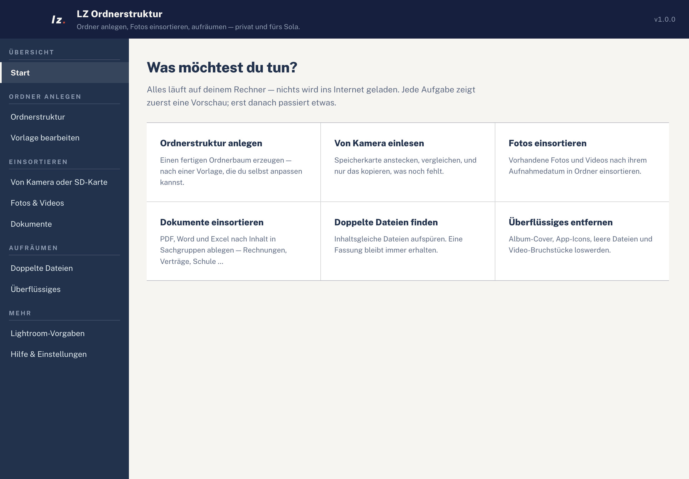
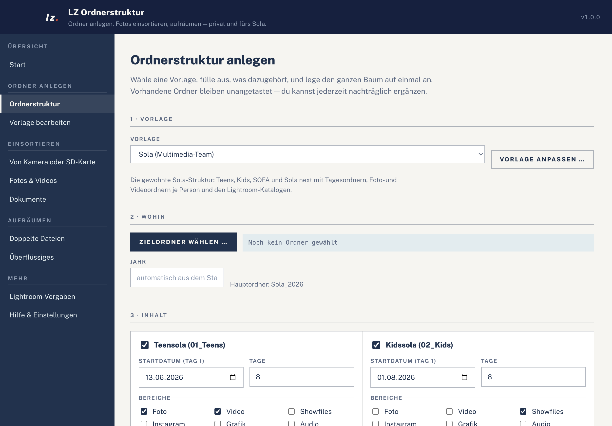
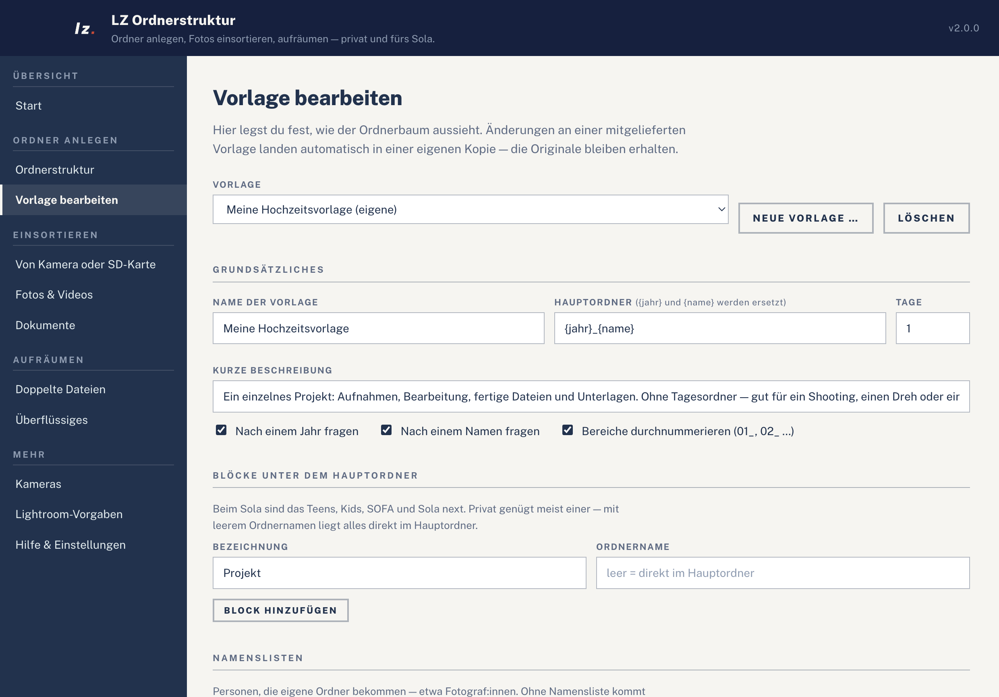
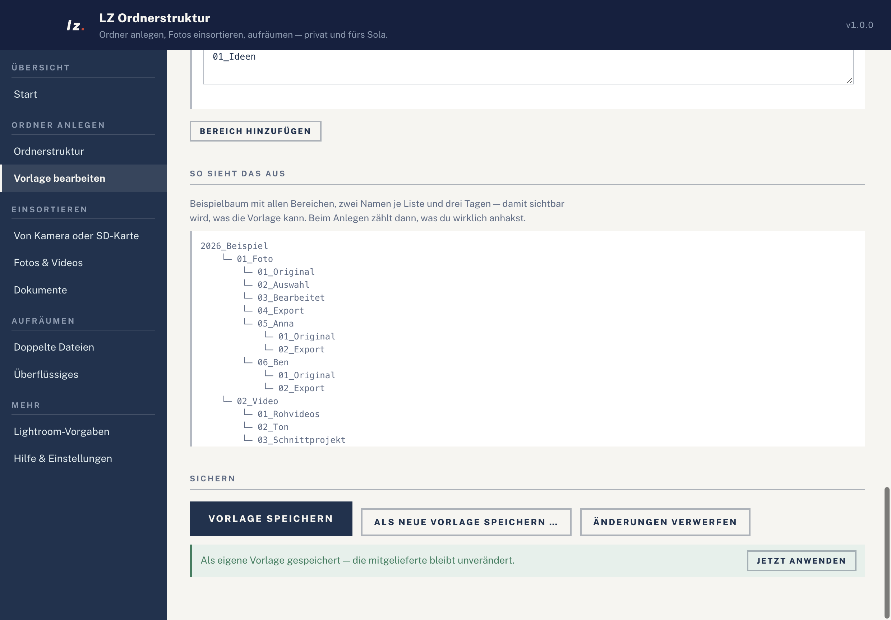
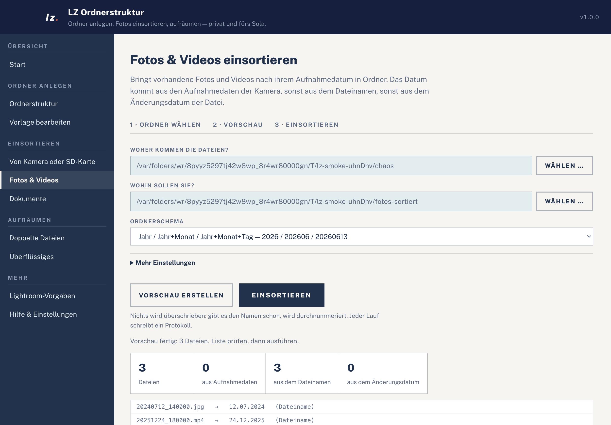
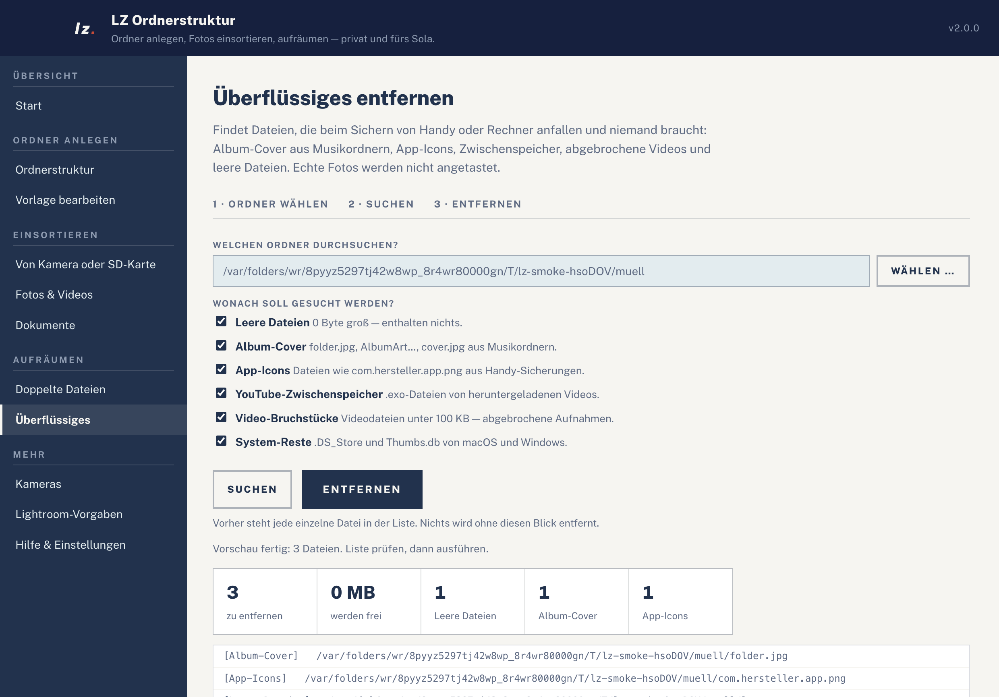
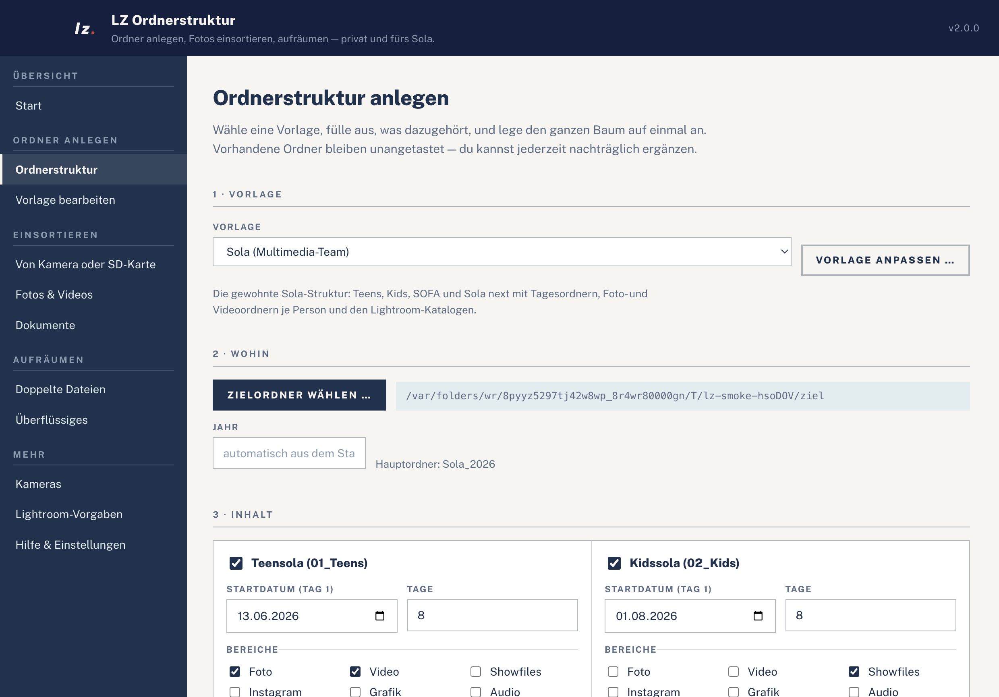
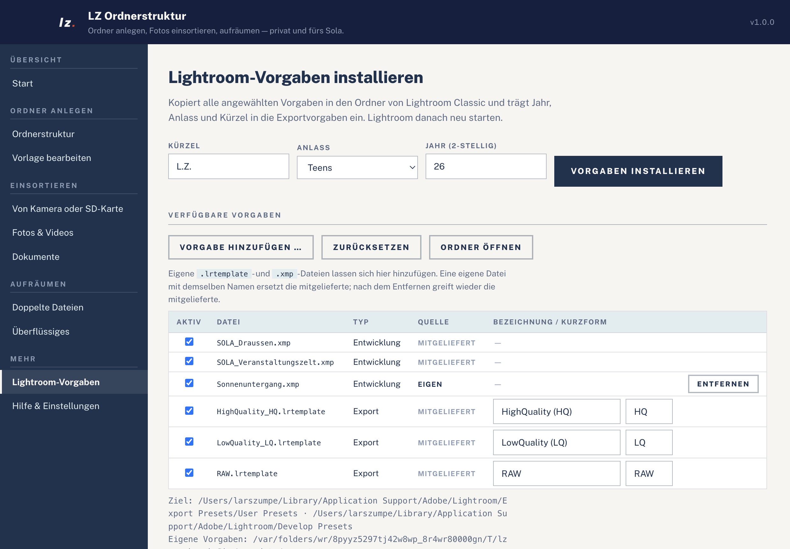
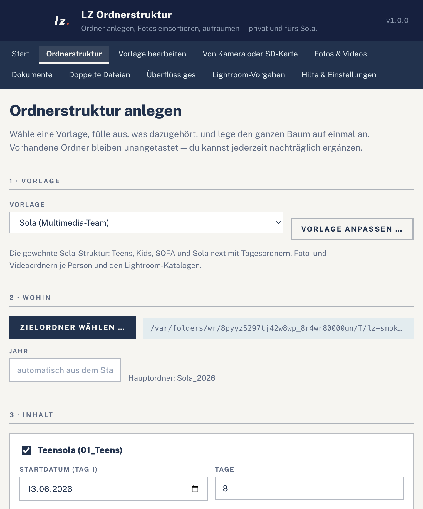
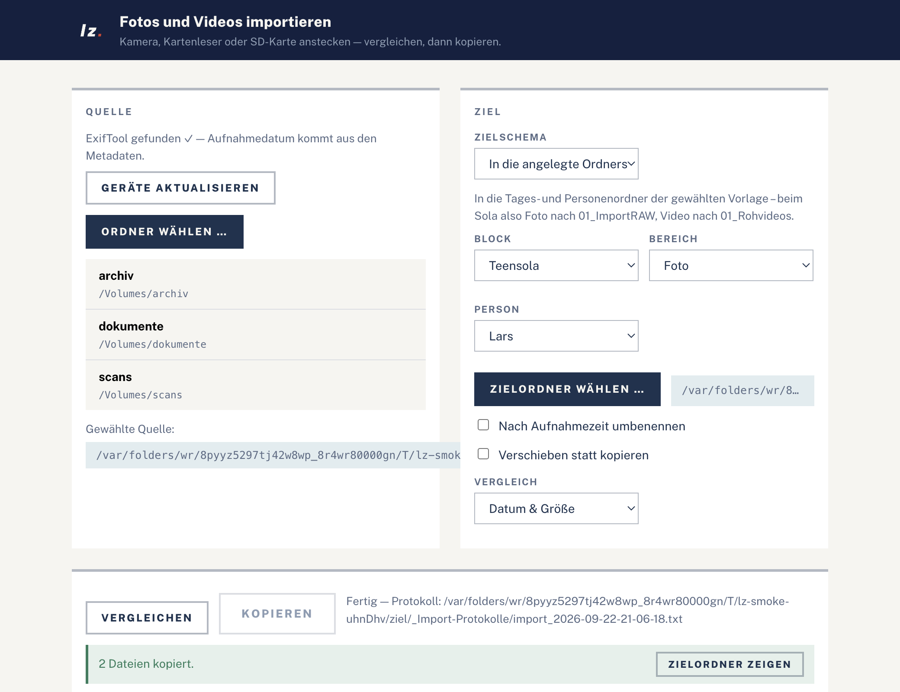

# LZ Ordnerstruktur

Ein Werkzeug für Ordner und Dateien — **auf macOS und auf Windows**, ganz ohne
Internet. Es

* **legt Ordnerstrukturen an** — nach einer Vorlage, die sich in der App frei
  ändern lässt: fürs Sola-Multimedia-Team genauso wie für eine Hochzeit, einen
  Urlaub oder das private Archiv,
* **liest Fotos und Videos von Kamera oder SD-Karte ein** — vergleichen,
  dann nur das Fehlende kopieren,
* **sortiert vorhandene Dateien ein** — Fotos nach Aufnahmedatum, Dokumente
  nach Inhalt,
* **räumt auf** — doppelte Dateien, Album-Cover, App-Icons, leere Dateien.

Der Ordner-Teil geht auf
[TH0RB3Nger/SOLA_Ordnerstrucktur](https://github.com/TH0RB3Nger/SOLA_Ordnerstrucktur)
zurück (VB.NET / WinForms, nur Windows); das Einsortieren und Aufräumen kommt
aus dem [LZ Sortierer](https://github.com/larszu/lz-sortierer). Beides steckt
jetzt in einer App.

## Die App

| | |
| --- | --- |
|  |  |
| Startseite — was möchtest du tun? | Ordnerstruktur, ausgefüllt |
|  |  |
| Die Vorlage in der Oberfläche ändern | … und sofort sehen, was dabei herauskommt |
|  |  |
| Fotos nach Aufnahmedatum einsortieren | Aufräumen, Kategorie für Kategorie |
|  |  |
| Angelegt — Vorschau und Ergebnis stimmen überein | Verwaltung der Lightroom-Vorgaben |

Die Oberfläche passt sich der Fensterbreite an; unter 900 px wandert die
Navigation nach oben und die Blöcke stehen untereinander:



Ein eigenes **Importfenster** kopiert Fotos und Videos direkt von Kamera,
Kartenleser oder SD-Karte in die richtigen Ordner — es erkennt den Datenträger,
**vergleicht zuerst** mit dem Ziel (wie FreeFileSync) und kopiert dann nur, was fehlt:



Die Bilder entstehen beim Headless-Durchlauf (`npm run smoke`) und sind damit immer
der tatsächliche Stand der App.

## Sicherheit

Die App fasst Dateien an — deshalb gilt überall dasselbe:

* **Erst Vorschau, dann Ausführen.** Jede Aufgabe zeigt zuerst Zeile für Zeile,
  was sie tun würde. Erst ein zweiter Klick tut es wirklich.
* **Nichts wird überschrieben.** Bei gleichem Namen wird durchnummeriert
  (`_1`, `_2` …).
* **Entfernt wird in den Papierkorb**, nicht endgültig gelöscht (abschaltbar
  unter *Hilfe & Einstellungen*).
* **Protokoll.** Jeder Lauf schreibt mit, was er getan hat — im Zielordner
  unter `_Sortier-Protokolle` bzw. `_Import-Protokolle`.
* **Alles bleibt lokal.** Die App lädt nichts ins Internet.

## Installation

Fertige Pakete liegen unter [Releases](../../releases). Die Dateien entstehen
automatisch per GitHub Actions (`.github/workflows/release.yml`), sobald ein Tag
`v*` geschoben wird.

| Plattform | Datei |
| --- | --- |
| macOS (Apple Silicon) | `LZ-Ordnerstruktur-<version>-arm64.dmg` |
| macOS (Intel) | `LZ-Ordnerstruktur-<version>-x64.dmg` |
| Windows (Installer) | `LZ-Ordnerstruktur-<version>-x64-Setup.exe` |
| Windows (ohne Installation) | `LZ-Ordnerstruktur-<version>-x64-portable.exe` |

### Hinweis zur ersten Ausführung

Die Pakete tragen **kein Entwicklerzertifikat** — dafür bräuchte es ein
kostenpflichtiges Apple-Developer- bzw. Code-Signing-Zertifikat.

* **macOS:** Beim ersten Start meldet Gatekeeper, die App stamme von einem
  unbekannten Entwickler. Rechtsklick auf die App → *Öffnen* → *Öffnen*.
  Danach startet sie wie jede andere.
* **Windows:** SmartScreen zeigt *„Der Computer wurde geschützt"* →
  *Weitere Informationen* → *Trotzdem ausführen*.

#### Warum die App nicht mehr „beschädigt" ist

Ohne Zertifikat überspringt electron-builder das Signieren vollständig. Übrig
bleibt dann nur die `linker-signed`-Signatur der Electron-Binärdatei — sie
deckt weder die `Info.plist` noch die Ressourcen ab (`Sealed Resources=none`),
und `codesign --verify` meldet *„code has no resources but signature indicates
they must be present"*. Auf Apple Silicon führt genau das dazu, dass der Finder
nicht „unbekannter Entwickler" sagt, sondern **„… ist beschädigt und kann nicht
geöffnet werden"** — obwohl an der Datei nichts fehlt.

`scripts/adhoc-sign.js` hängt sich deshalb als `afterPack` in den Bau und
signiert das fertige Bundle **ad hoc** (`codesign --sign -`). Das versiegelt die
App ohne Zertifikat; sie gilt weiterhin als nicht verifiziert, aber nicht mehr
als beschädigt. Ist ein echtes Zertifikat gesetzt (`CSC_LINK`/`CSC_NAME`), hält
sich der Haken heraus.

Wer trotzdem einmal auf eine „beschädigte" Datei stößt — etwa ein älteres
Release —, entfernt die Quarantäne-Markierung von Hand:

```bash
xattr -dr com.apple.quarantine "/Applications/LZ Ordnerstruktur.app"
```

### Freiwillige Hilfsprogramme

Beide sind optional; ohne sie arbeitet die App weiter, weiß aber weniger über
die Dateien. *Hilfe & Einstellungen* zeigt, was gefunden wurde.

```bash
brew install exiftool   # zuverlässige Aufnahmedaten, besonders bei RAW und Video
brew install poppler    # pdftotext: liest den Text aus PDF-Dateien
```

Unter Windows: [exiftool.org](https://exiftool.org) bzw. die
poppler-utils. Ohne ExifTool kommt das Aufnahmedatum aus Dateiname oder
Änderungsdatum; ohne pdftotext landen PDFs unter *Scans ohne Textebene*.

## Ordnerstruktur anlegen

1. **Vorlage wählen.** Mitgeliefert sind fünf:

   | Vorlage | Wofür |
   | --- | --- |
   | **Sola (Multimedia-Team)** | die gewohnte Sola-Struktur, unverändert |
   | **Projekt (Foto oder Film)** | ein Shooting, ein Dreh, ein Auftrag |
   | **Reise oder Veranstaltung** | je Tag ein Ordner |
   | **Privates Archiv** | Fotos, Dokumente, Finanzen, Sonstiges |
   | **Eigene Struktur** | leerer Ausgangspunkt |

2. **Zielordner** wählen, dazu Jahr und/oder Name — je nachdem, was die Vorlage
   braucht. Rechts steht immer, wie der Hauptordner heißen wird.
3. **Inhalt** ausfüllen: Blöcke anhaken, Zeitraum und Bereiche wählen, Namen
   eintragen. Die Namensfelder sind nur freigegeben, wenn ein angewählter
   Bereich sie überhaupt benutzt.
4. **Vorschau** prüfen und **Ordner jetzt anlegen** klicken. Die Vorschau zeigt
   exakt das, was danach auf der Platte landet.

Das Anlegen ist **wiederholbar**: Vorhandene Ordner werden übersprungen, nicht
überschrieben. Wer nachträglich eine Person ergänzt, startet den Vorgang einfach
noch einmal — der bestehende Inhalt bleibt unangetastet.

Der Stand wird automatisch gemerkt, je Vorlage getrennt. Zusätzlich lässt er
sich über *Einstellungen speichern / laden* (auch `⌘S`/`⌘O` bzw. `Strg+S`/`Strg+O`)
als Datei sichern und weitergeben.

### Vorlagen selbst bauen

Unter *Vorlage bearbeiten* steht der ganze Aufbau als Formular. Eine Vorlage
besteht aus vier Dingen:

| Baustein | Bedeutung |
| --- | --- |
| **Hauptordner** | Muster für den obersten Ordner — `{jahr}` und `{name}` werden eingesetzt. Bleibt ein Wert leer, fällt das Trennzeichen davor mit weg: aus `{jahr}_{name}` wird ohne Jahr schlicht der Name. |
| **Blöcke** | was direkt unter dem Hauptordner liegt (beim Sola: Teens, Kids, SOFA, Sola next). Mit leerem Ordnernamen liegt alles direkt im Hauptordner — privat meist das Richtige. |
| **Namenslisten** | Personen, die eigene Ordner bekommen (beim Sola: Fotograf:innen, Videograf:innen). |
| **Bereiche** | was ein Block enthalten kann. Entweder *ein Ordner mit festen Unterordnern* oder *je Tag ein Ordner* — mit festen Ordnern darin und wahlweise einem Ordner je Person. |

In den Ordnermustern der Tagesordner stehen `{nr}` (1, 2, 3 …), `{nr2}`
(01, 02, 03 …) und `{datum}` (`dd-MM-yyyy`) zur Verfügung.

Die Personenordner **setzen die Nummerierung ihres Elternordners fort**: Beim
Sola stehen deshalb die Fotograf:innen als `05_…`, `06_…` hinter den vier festen
Tagesordnern, die Videograf:innen im leeren `01_Rohvideos` dagegen ab `01_…`.

Mitgelieferte Vorlagen sind schreibgeschützt. Wer eine ändert und speichert,
bekommt automatisch eine **eigene Kopie**; das Original bleibt erhalten. Eigene
Vorlagen liegen als JSON im Benutzerdatenordner und überstehen ein Update. Eine
eigene Vorlage mit der Id einer mitgelieferten (z. B. `sola`) tritt an deren
Stelle — nach dem Löschen gilt wieder die mitgelieferte.

### Die Sola-Struktur

```
Sola_2026/
├── 01_Teens/
│   ├── 01_Foto/
│   │   ├── 1_Tag_13-06-2026/
│   │   │   ├── 01_Bilder_des_Tages_1_HQ/
│   │   │   ├── 02_Bilder_des_Tages_1_LQ/
│   │   │   ├── 03_Auswahl Bilderclip/
│   │   │   ├── 04_Auswahl Musik/
│   │   │   └── 05_<Name>/            (je Fotograf:in)
│   │   │       ├── 01_ImportRAW/
│   │   │       ├── 02_ExportJPEG_HQ/
│   │   │       ├── 03_ExportJPEG_LQ/
│   │   │       └── 04_ExportRAW/
│   │   ├── … 2_Tag bis 8_Tag …
│   │   └── LR Kataloge/
│   │       └── 01_<Name>/            (je Fotograf:in)
│   ├── 02_Video/
│   │   └── 1_Tag_13-06-2026/
│   │       ├── 01_Rohvideos/
│   │       │   └── 01_<Name>/        (je Videograf:in)
│   │       ├── 02_Projektdatein/
│   │       └── 03_Audio-Musik/
│   ├── 03_Showfiles/                 (nur Tagesordner)
│   ├── 04_Instagram/
│   ├── 05_Grafik/
│   ├── 06_Audio/                     (nur Tagesordner)
│   ├── 07_Orga/
│   └── 08_Allgemein/
├── 02_Kids/                          (gleicher Aufbau)
├── 03_SOFA/
└── 04_Sola_next/
```

Die Bereiche werden in der festen Reihenfolge *Foto, Video, Showfiles,
Instagram, Grafik, Audio, Orga, Allgemein* nummeriert — nur angewählte Bereiche
verbrauchen eine Nummer. Sind also nur *Video* und *Orga* gewählt, entstehen
`01_Video` und `02_Orga`.

Die Sola-Ordner sind **fest nummeriert** und hängen nicht an der Anwahl: Wer
zuerst nur SOFA anlegt, bekommt `03_SOFA` — ergänzt man später Teens, kommt
`01_Teens` daneben, statt dass sich Bestehendes verschiebt.

Die Dauer ist je Sola einstellbar (1 bis 31 Tage, voreingestellt 8), gerechnet
ab dem jeweiligen Startdatum. Die Solas dürfen unterschiedlich lang sein und zu
verschiedenen Terminen stattfinden — nur das Jahr muss zusammenpassen, sonst
fragt die App nach einer manuellen Eingabe.

#### Abweichungen zum Windows-Original

Die Struktur ist die des Originals, an drei Stellen aber vereinheitlicht — im
Original hatten Teens und Kids uneinheitliche Namen, teils mit fehlendem
Trennzeichen oder als roher `Date`-Wert:

* Tagesordner heißen jetzt überall `<n>_Tag_<dd-MM-yyyy>` (Original: mal
  `_Tag_1_13-06-2022`, mal `Tag_1_Mon Jun 13 2022 …`, im Audio-Ordner
  `_Tag_113-06-2022`).
* Bei Kids wird derselbe formatierte Datumsstring verwendet wie bei Teens.
* Fehlerhafte Zeichen in Namen (`/`, `:`, `\`, …) werden zu `_`, damit derselbe
  Name auf macOS und Windows funktioniert. Auch die unter Windows reservierten
  Namen (`CON`, `PRN`, `LPT1`, …) sind abgefangen.

Sonst gilt: gleiche Ordnernamen, gleiche Nummerierung, gleiche Lightroom-Vorgaben.

#### Konfigurationsdateien

Gespeichert wird als **JSON**; bei der Sola-Vorlage zusätzlich als **CSV** im
Format des Windows-Originals — CSV-Dateien aus der alten Version lassen sich
also direkt laden. Beim Datum werden `dd-MM-yyyy`, `dd.MM.yyyy`, `MM/dd/yyyy`
und ISO `yyyy-MM-dd` erkannt.

Das alte CSV-Format kennt allerdings nur Teens und Kids mit acht Tagen. Wer
SOFA, Sola next oder eine abweichende Dauer eingestellt hat und trotzdem als
CSV speichert, bekommt beim Speichern aufgelistet, was dabei wegfällt — für den
vollständigen Stand ist JSON das Format.

## Fotos und Videos einsortieren

Bringt **vorhandene** Fotos und Videos nach ihrem Aufnahmedatum in Ordner. Das
Datum kommt — in dieser Reihenfolge — aus den Aufnahmedaten der Kamera, sonst
aus dem Dateinamen, sonst aus dem Änderungsdatum. Die Vorschau zeigt je Datei,
woher es stammt.

Vier Ordnerschemata stehen zur Wahl:

| Schema | Beispiel |
| --- | --- |
| Jahr / Jahr+Monat / Jahr+Monat+Tag | `2026 / 202606 / 20260613` |
| Jahr / Monat | `2026 / 06 Juni` |
| Jahr / Jahr-Monat-Tag | `2026 / 2026-06-13` |
| Nur nach Jahr | `2026` |

Dazu wahlweise: umbenennen in `JJJJMMDD_HHMMSS`, Fotos und Videos in getrennte
Bäume, kopieren statt verschieben und ein zusätzlicher Unterordner (etwa
`_Handy`).

## Dokumente einsortieren

Legt PDF-, Word-, Excel- und PowerPoint-Dateien nach ihrem **Inhalt** in
Sachgruppen ab und benennt sie nach ihrer Überschrift. Keine KI: gezählt wird,
wie oft ein Stichwort im Text vorkommt; die Gruppe mit den meisten Treffern
gewinnt. Bei null Treffern oder Gleichstand landet die Datei in `Unsortiert` —
es wird nicht geraten.

Die **Sachgruppen sind in der App editierbar** (unter *Mehr Einstellungen*):
Ordnername und Stichwörter, beliebig viele Gruppen, jederzeit auf den Standard
zurücksetzbar. Mitgeliefert sind zehn: Rechnungen, Verträge und Versicherungen,
Steuer und Finanzen, Schule und Ausbildung, Glaube und Gemeinde, Fotografie und
Aufträge, Medizin und Gesundheit, Bewerbung, Behörden und Amtliches,
Anleitungen und Handbücher.

PDFs ohne Textebene (reine Scans) und unlesbare Dateien bekommen eigene Ordner,
statt irgendwo einsortiert zu werden.

## Doppelte Dateien

Sucht Dateien mit **gleichem Inhalt** — auch wenn sie anders heißen. Geprüft
wird in drei Stufen: erst nach Dateigröße gruppiert, dann über das erste
Megabyte vorgeprüft, erst zum Schluss die ganze Datei gehasht. So wird nur
gelesen, was wirklich in Frage kommt.

Entfernt wird immer nur die Kopie; je Gruppe bleibt eine Datei liegen — der mit
dem kürzesten Namen, also meist das Original ohne `_1`.

## Überflüssiges entfernen

Findet, was beim Sichern von Handy oder Rechner anfällt und niemand braucht.
Jede Kategorie lässt sich einzeln an- und abwählen:

| Kategorie | Was gemeint ist |
| --- | --- |
| Leere Dateien | 0 Byte groß |
| Album-Cover | `folder.jpg`, `AlbumArt…`, `cover.jpg` aus Musikordnern |
| App-Icons | Dateien wie `com.hersteller.app.png` aus Handy-Sicherungen |
| YouTube-Zwischenspeicher | `.exo`-Dateien |
| Video-Bruchstücke | Videodateien unter 100 KB — abgebrochene Aufnahmen |
| System-Reste | `.DS_Store`, `Thumbs.db`, `desktop.ini` |

Echte Fotos werden nicht angetastet, und vor dem Entfernen steht jede einzelne
Datei in der Liste.

## Lightroom-Vorgaben

Mitgeliefert werden drei Exportvorgaben (`HighQuality_HQ`, `LowQuality_LQ`,
`RAW`) und zwei Entwicklungsvorgaben (`SOLA_Draussen`,
`SOLA_Veranstaltungszelt`). In die Exportvorgaben trägt die App
`internalName`, `title`, `tokenCustomString` und `tokens` ein, also
z. B. `SOLA26_Teens_HighQuality (HQ)` und das Kürzel.

### Eigene Vorgaben

Die mitgelieferten Vorgaben sind nur der Ausgangspunkt — unter *Verfügbare
Vorgaben* lässt sich der Bestand ändern, ohne die App neu zu bauen:

* **Hinzufügen** — beliebige `.lrtemplate`- und `.xmp`-Dateien einlesen, auch
  mehrere auf einmal.
* **Ersetzen** — eine eigene Datei mit demselben Dateinamen tritt an die Stelle
  der mitgelieferten. Nach dem *Entfernen* greift wieder die mitgelieferte;
  überschrieben wird nichts.
* **Ab- und anwählen** — jede Vorgabe hat ein Häkchen. Nur angehakte werden
  installiert. Mitgelieferte lassen sich abwählen, aber nicht löschen.
* **Bezeichnung und Kurzform** — bei Exportvorgaben direkt in der Tabelle
  editierbar. Sie landen im Vorgabennamen (`SOLA26_Teens_<Bezeichnung>`) und im
  Dateinamen-Token (`…_<Kurz>_{{image_name}}`). Bei neuen Dateien schlägt die
  App beides aus dem Dateinamen vor.
* **Zurücksetzen** — verwirft alle eigenen Vorgaben und Abwahlen.

Eigene Vorgaben liegen im Benutzerdatenordner der App und überstehen damit ein
Update. Der Pfad steht in der App unten im Abschnitt; *Ordner öffnen* springt hin.

Zielordner beim Installieren:

| Plattform | Pfad |
| --- | --- |
| macOS | `~/Library/Application Support/Adobe/Lightroom/{Develop Presets, Export Presets/User Presets}` |
| Windows | `%APPDATA%\Adobe\Lightroom\{Develop Presets, Export Presets\User Presets}` |

## Von Kamera oder SD-Karte einlesen

Über *Importfenster öffnen* bzw. `⌘I`/`Strg+I` öffnet sich ein **eigenes
Fenster**. Der Ablauf ist an [FreeFileSync](https://freefilesync.org)
angelehnt: **Quelle und Ziel wählen, vergleichen, dann kopieren** — ohne im
Finder/Explorer zu hantieren.

* **Gerät anstecken** — Kameras, Kartenleser und SD-Karten werden erkannt
  (an ihrem `DCIM`-Ordner) und stehen mit einem Klick als Quelle bereit.
  *Geräte aktualisieren* liest neu ein; alternativ *Ordner wählen*.
* **Vergleichen** — vor dem Kopieren zeigt das Fenster für jede Datei, ob sie
  **neu** (wird kopiert), **schon vorhanden** (wird übersprungen) oder
  **abweichend** ist (gleicher Zielname, anderer Inhalt → wird als Kopie
  angelegt). Die Vergleichsmethode ist wählbar, ebenfalls nach FreeFileSync-Art:
  *Datum & Größe* (schneller Standard), *Inhalt* (Byte für Byte per Prüfsumme)
  oder *Nur Größe*.
* **Kopieren** — nur das Fehlende wird geschrieben. Steckt man dieselbe Karte
  erneut an, meldet der Vergleich alles als „schon vorhanden".

> FreeFileSync ist GPL-Software. Hier ist nur die bewährte **Logik** nachgebaut
> (die drei Vergleichsmethoden, das „nur Fehlendes kopieren, nichts löschen",
> das Erhalten der Änderungszeit) – es wurde kein Code übernommen.

Das **Zielschema** ist wählbar:

* **In die angelegte Ordnerstruktur** — jede Datei kommt in den Tages- und
  Personenordner der Vorlage, die im Hauptfenster eingestellt ist. Beim Sola
  also Fotos nach `…/NN_Foto/<n>_Tag_<dd-MM-yyyy>/PP_<Name>/01_ImportRAW`,
  Videos nach `…/NN_Video/<n>_Tag_<dd-MM-yyyy>/01_Rohvideos/PP_<Name>`. Block,
  Bereich und Person werden aus der Konfiguration gewählt. Dateien, deren Datum
  außerhalb der Tage liegt, bleiben liegen und werden in der Vorschau aufgeführt.
* **Datumsbaum** (`JJJJ/JJJJMM/JJJJMMDD`) — sortiert rein nach Aufnahmedatum,
  ohne Vorlage. Optional in einen Unterordner `_Handy`.

Weitere Schemata lassen sich in `src/core/importPlan.js` ergänzen, ohne den Rest
anzufassen.

Es gelten dieselben Sicherheitsprinzipien wie überall, plus:

* **Kopieren statt Verschieben** ist die Voreinstellung — die Speicherkarte bleibt
  unangetastet. Verschieben ist ein bewusstes Häkchen.
* **Wiederholbar** — schon vorhandene Dateien (nach der gewählten
  Vergleichsmethode) werden beim zweiten Lauf übersprungen, nichts verdoppelt
  sich. Die Änderungszeit der Quelle bleibt erhalten, damit der Vergleich sie
  wiedererkennt.

Videos aus QuickTime (`.mov`, `.mp4`) werden mit `-api QuickTimeUTC` von UTC auf die
lokale Zeit umgerechnet, damit sie im richtigen Tagesordner landen.

## Gestaltung

Die App folgt dem **Brand Guide 2.0 der Lars Zumpe Medienproduktion**
(September 2026): Zumpe Navy und Deep Navy als Flächen, Off-White als Grund,
Stahlblau für Linien, Schiefer für Sekundärtext, Public Sans als Schrift.
Blau bleibt die Marke, Rot ist das Signal — Tally-Rot kommt genau zweimal vor,
im Signet der Kopfzeile und im Fokusring. Keine Rundungen, keine Schatten,
keine Verläufe: Struktur entsteht durch die Linie.

Die Programmsymbole werden aus der Logo-Geometrie des Brand Kits erzeugt:

```bash
npm run logo   # schreibt build/icon.png, build/icon.ico und src/renderer/signet.png
```

## Entwicklung

```bash
npm install
npm start          # App starten
npm test           # Tests der Kernlogik (node:test, ohne Oberfläche)
npm run smoke      # Headless-Durchlauf durch die echte App (Linux, via xvfb-run)
npm run smoke:mac  # derselbe Durchlauf auf macOS/Windows, mit sichtbarem Fenster
npm run dist:mac   # .dmg bauen (nur auf macOS)
npm run dist:win   # .exe bauen (auf Windows; via wine auch anderswo)
```

### Ein Release herausgeben

Der Tag ist die Quelle der Wahrheit: Aus `v1.1.0` wird die Version `1.1.0`, und
mit der benennt electron-builder die Pakete. Der Lauf schreibt sie vor dem Bau
selbst in die `package.json` — eine dort vergessene Zeile hält also kein Release
mehr auf. Der Tag muss dafür nur eine brauchbare Versionsnummer ergeben
(`v<major>.<minor>.<patch>`, Suffixe wie `-beta.1` erlaubt).

```bash
npm version 1.1.0        # setzt package.json und legt den Tag v1.1.0 an
git push origin main --follow-tags
```

Danach läuft `.github/workflows/release.yml` und

1. prüft die Tests und leitet die Version aus dem Tag ab,
2. legt einen **Release-Entwurf** an (Tags mit Suffix wie `v1.1.0-beta.1`
   werden als Vorabversion markiert),
3. baut auf macOS und Windows und hängt die vier Pakete an den Entwurf,
4. gibt den Entwurf frei — aber nur, wenn wirklich alle vier Dateien da sind.

Scheitert eine Plattform, bleibt der Entwurf unveröffentlicht liegen; niemand
lädt dann ein halbes Release herunter. Nach dem Beheben lässt sich der Lauf
unter *Actions → Release → Run workflow* mit demselben Tag wiederholen — der
bestehende Entwurf wird weiterverwendet.

`.github/workflows/build.yml` baut dieselben Pakete bei jedem Push, aber ohne
zu veröffentlichen; die Dateien hängen dort 14 Tage als Artefakt am Lauf.

### Headless-Durchlauf

`npm run smoke` startet den echten Hauptprozess, klickt sich durch alle
Ansichten und prüft unter anderem:

* die Vorschau zeigt genau den Baum, der danach auf der Platte liegt,
* die Tagesordner sortieren nach Tag und stehen vor `LR Kataloge`,
* alle vier Solas bekommen ihren festen Ordner, und die eingestellte Dauer
  schlägt auf die Anzahl der Tagesordner durch,
* ein Wechsel der Vorlage baut einen anderen Baum, und eine geänderte Vorlage
  wird als eigene Kopie gespeichert, ohne die mitgelieferte anzurühren,
* eine eigene Lightroom-Vorgabe erscheint in der Tabelle, lässt sich abwählen
  und entfernen,
* das Importfenster öffnet sich, vergleicht, legt die Dateien anhand ihres Datums
  im richtigen Tages- und Personenordner (`01_ImportRAW`) ab, lässt die Quelle heil
  und erkennt einen zweiten Lauf als „schon vorhanden",
* das Einsortieren bringt Fotos und Videos in den Datumsbaum und schreibt ein
  Protokoll, die Duplikatsuche behält je Gruppe eine Datei, und das Aufräumen
  lässt echte Fotos liegen,
* bei 1240, 900 und 620 px Fensterbreite scrollt die Seite nicht seitlich.

Dabei entstehen die Screenshots in `docs/screenshots/`. Der Lauf endet mit
Code 1, sobald eine Prüfung fehlschlägt — er taugt also für CI.

### Aufbau

```
src/core/       Plattformunabhängige Logik, ohne Electron-Abhängigkeit
  vorlagen.js     das Vorlagenmodell und der Ordnerbau (rein funktional);
                  hier stehen auch die fünf mitgelieferten Vorlagen
  vorlagenStore.js  eigene Vorlagen im Benutzerdatenordner
  structure.js    die Sola-Sicht darauf (SOLAS, BEREICHE, buildPlan)
  createStructure.js  legt die berechnete Ordnerliste auf der Platte an
  sortieren.js    die vier Aufgaben: Fotos, Dokumente, Duplikate, Aufräumen
  sachgruppen.js  Stichwortlisten, nach denen Dokumente zugeordnet werden
  einstellungen.js  gemerkte Ordner, Optionen und Sachgruppen
  werkzeuge.js    findet exiftool und pdftotext, beides freiwillig
  exif.js         ExifTool-Anbindung (nur Lesen der Metadaten)
  devices.js      erkennt angesteckte Wechseldatenträger (Kamera/SD über DCIM)
  importPlan.js   ordnet Dateien anhand ihres Datums einem Zielschema zu
  importRun.js    sammelt Medien, vergleicht (FreeFileSync-Art), setzt um
  lightroom.js    Preset-Pfade je Plattform, Kopieren und Anpassen
  presetStore.js  führt mitgelieferte und eigene Vorgaben zusammen
  config.js       JSON- und CSV-Format (Letzteres kompatibel zum Original)
  dates.js        Tagesberechnung, Jahresermittlung
  validate.js     Namensprüfung und Absicherung der Ordnernamen
src/main/       Electron-Hauptprozess: Fenster, Menü, Dialoge, IPC
src/renderer/   Oberfläche (HTML/CSS/JS, ohne Node-Zugriff)
scripts/smoke.js    Headless-Durchlauf, erzeugt zugleich die Screenshots
scripts/logo.js     erzeugt die Programmsymbole aus der Logo-Geometrie
resources/presets/  Die mitgelieferten Lightroom-Vorlagen
```

`vorlagen.js` ist bewusst rein funktional: Die Vorschau in der Oberfläche und
das tatsächliche Anlegen benutzen dieselbe Liste, sie können also nicht
auseinanderlaufen. Getestet wird gegen diese Liste und gegen einen echten
Anlagevorgang in einem temporären Ordner.

Wer die Struktur ändern will, tut das **in der App** unter *Vorlage
bearbeiten* — nicht im Quelltext. Die mitgelieferten Vorlagen stehen als Daten
am Kopf von `src/core/vorlagen.js`.

## Lizenz

MIT — siehe [LICENSE](LICENSE). Ursprüngliches Werk und Lightroom-Vorgaben:
Thorben Renfordt.
